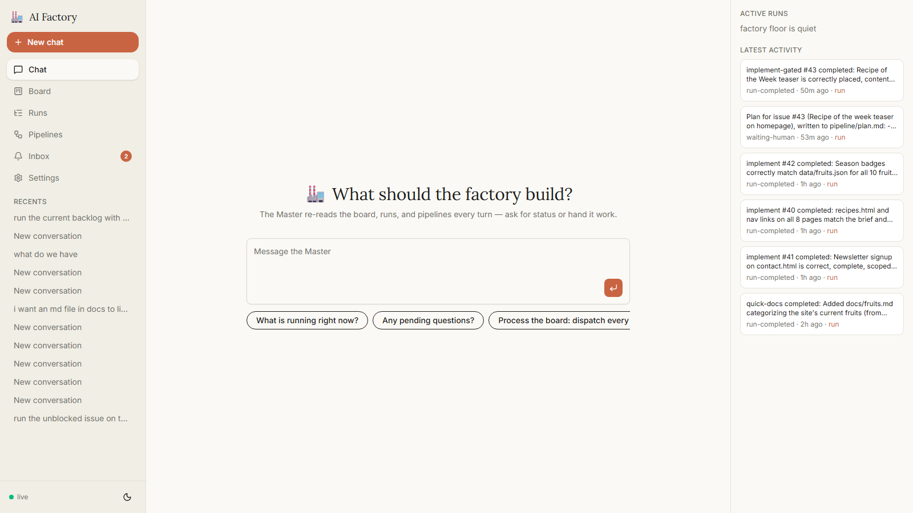
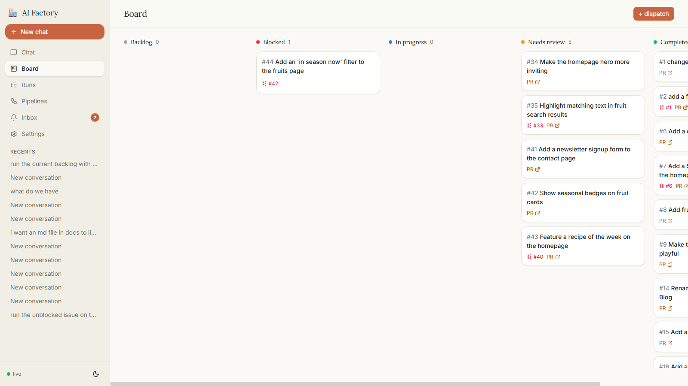

# 🏭 AI Factory

**A self-hosted software factory: GitHub issues go in, reviewed pull requests come out.**

You talk to a **Master agent** in a chat console (or click a card on a kanban board). It dispatches
**pipelines** — sequences of steps you define as plain data — and each step runs as a full
[Claude Agent SDK](https://docs.anthropic.com/en/docs/agents/claude-agent-sdk) session inside an
ephemeral Docker container: it clones your repo, plans, writes code, commits, and hands off to the
next step (like an independent review with fresh eyes). The factory opens the PR. **You merge it.**



## Why it's different

- **You stay in control.** Humans merge every PR. Pipelines can pause mid-run and ask you a
  question (approve a plan, pick an option) — while paused, there are **zero** containers running
  and zero spend.
- **Pipelines are data, not code.** A pipeline is just steps: a behavior prompt, a model, a tool
  allowlist, an optional output artifact, retry and timeout budgets. Create one in the UI and the
  Master discovers it by its description — no engine changes, no redeploys.
- **Judgment lives in LLMs, bookkeeping lives in code.** Every step's output is contract-checked
  by code (verdict schema + the declared artifact must exist on the branch). Dependency checks,
  dedupe, idempotency, and refusals are computed — never vibes.
- **Everything is auditable and reproducible.** The UI renders exactly the public API, so anything
  you click can be replayed with `curl`. Every agent session streams its full log live.

## How it works

```
GitHub issue ──▶ Master chat / board / webhook / cron
                        │  dispatch (refused if blocked, closed, or already running)
                        ▼
                 pipeline run on branch issue-N
                 step 1 ▸ ephemeral worker: clone → plan → implement → commit → verdict
                 step 2 ▸ fresh worker, fresh eyes: review the diff → done | reject (retry w/ feedback)
                        │
                        ▼
                 pull request (⟵ the only thing that survives a worker: commits, artifacts, logs, events)
                 you merge ✓ → board flips to completed → dependent issues unblock
```

| Concept | What it is |
|---|---|
| **Master** | The chat agent on the home screen. Reads the factory's state fresh every turn; acts only through factory tools (dispatch, answer, cancel — never writes code itself). |
| **Pipeline** | An ordered list of steps stored as data. Ships with `implement` (plan+build → review) and `implement-gated` (same, but pauses for your plan approval). |
| **Run** | One pipeline execution against one issue/brief, on its own `issue-N` branch. Snapshots its pipeline definition at dispatch. |
| **Verdict** | Every step ends with structured output: `done` / `reject` / `failed` + a one-line summary that feeds the board, notifications, and retries. |
| **Questions** | A step granted `ask_human` can pause the run and wait (up to 30 days) for your answer — from the run page, the Inbox, or chat. |
| **Board** | Your GitHub issues projected into columns (backlog / blocked / in progress / needs review / completed), updated live. Declare dependencies with `Blocked-by: #N` in an issue body. |



## Getting started

**You need:** Docker (Desktop or Engine), a Claude subscription (Pro/Max), and a GitHub repo you
want the factory to work on plus a PAT that can push to it.

```bash
git clone https://github.com/SohaibBelaroussi/ai-factory.git && cd ai-factory
docker compose up -d --build
docker compose --profile tools build   # the worker image steps run in
```

Open **http://localhost:8080**, go to **Settings**, and set three values:

1. **claude-oauth-token** — run `claude setup-token` on your machine and paste the result.
2. **github-token** — a PAT that can read/write the target repo (a fine-grained token scoped to
   that one repo is recommended).
3. **github-repo** — `owner/name`.

The Settings page shows six health checks. The factory **refuses to dispatch anything** until all
of them are green — so if it's green, it works. Secrets live in the factory's database, never in
files; rotating a token is just pasting a new value.

<details>
<summary>Prefer the terminal? Everything is an API call.</summary>

```bash
curl -s http://localhost:3000/health
curl -s -X PUT http://localhost:3000/settings/claude-token -H "content-type: application/json" -d '{"value":"<from `claude setup-token`>"}'
curl -s -X PUT http://localhost:3000/settings/github-token -H "content-type: application/json" -d '{"value":"<PAT>"}'
curl -s -X PUT http://localhost:3000/settings/github-repo  -H "content-type: application/json" -d '{"value":"owner/name"}'
```

Optional substrate check — runs one real turn inside the worker image against your token
(`AUTH_OK` + a nonzero cost = the plumbing works):

```bash
CLAUDE_CODE_OAUTH_TOKEN=<token> ./scripts/worker-auth-test.sh
```

(Windows: `.\scripts\worker-auth-test.ps1 -Token <token>`.)
</details>

## Your first run

Type into the chat:

> *Process the board: dispatch every open, unblocked issue.*

The Master reads the board, checks each issue's dependencies and state, dispatches what's ready,
and tells you exactly what it refused and why (`blocked by #12`, `already running`, `issue closed`)
— refusals are structured data, not error strings. Or skip the chat entirely: hover an issue card
on the **Board** and hit **run**, pick a pipeline, go.

While a run is live you can watch the agent work — every tool call and result streams into the
run page. When it finishes you get one notification with the PR link. **Merge the PR on GitHub**;
the board flips to completed on the next sync and anything that was `Blocked-by` that issue
becomes dispatchable.

**Want a gate?** Dispatch with `implement-gated` and the run pauses after planning: the plan lands
in your Inbox as a question, the containers shut down, and nothing happens until you answer.
Qualified answers work — *"approved, but skip the emoji"* — the agent resumes the same session
with your words in front of it.

## Day-2 notes

- **Parallel runs** on different files/hunks merge cleanly. Two runs editing the **same lines**
  produce a conflicted second PR — the v1 policy is: close it, delete its branch, re-dispatch
  (the fresh run branches off the new main). Use `Blocked-by:` to serialize work that must overlap.
- **Triggers**: `POST /triggers` gives you an HMAC-signed webhook endpoint (point a GitHub webhook
  at `/hooks/:id` for instant issue sync / auto-dispatch) or a cron schedule. Replayed deliveries
  never double-spawn.
- **Auth**: set `OPERATOR_TOKEN` in `.env` to require a bearer token on the whole public API; the
  UI sends it from Settings → Operator token. Empty = local dev only.
- **Worker security**: agent sessions run with a per-step tool allowlist and a stripped
  environment (no internal tokens, no bypass modes). The GitHub token workers push with has
  whatever scope your PAT has — scope it to the one target repo.
- **Going to production**: the VM checklist (operator token, real Inngest keys, volume backups,
  webhook, fine-grained PAT) is in [docs/IMPLEMENTATION.md](docs/IMPLEMENTATION.md) §14.

## Repo layout

| Path | What |
|---|---|
| `docker-compose.yml` | `pg` + `inngest` (self-hosted, durable runner) + `backend` + `web`; `worker` build-only profile |
| `backend/` | Public + internal API, migrations, Inngest runner functions, Master service, container provisioner |
| `worker/` | The ephemeral step-worker image (Claude Agent SDK + pinned CLI) |
| `web/` | The console — React SPA (shadcn/ui + AI SDK Elements), served by nginx on **:8080** |
| `docs/IMPLEMENTATION.md` | The deep record: architecture, full API surface, internals, verification log, gotchas |
| `spec files/` | The product spec and locked architecture the system was built from |

Ports: web **:8080** · API **:3000** · Inngest dashboard **:8288**.

---

Built end-to-end by [Claude Code](https://claude.com/claude-code) against a live test repo —
the verification record (real runs, forced failures, suspend/resume, webhook replays, merge
conflicts and recovery) is in [docs/IMPLEMENTATION.md](docs/IMPLEMENTATION.md) §11.
